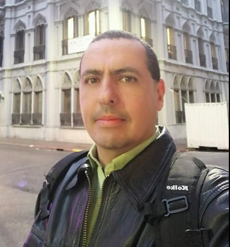

Jorge Escalona
============

> MyAddress
> Av Duraznos 1256
> Piso 1 #9
> Montevideo
> cellphone +59898698848

Education
---------

2005-2010
:   **telecommunications engineering**; [Fermín Toro University](http://www.uft.edu.ve/ "UFT") (Venezuela)

    Thesis title: Programmable logic controller with data transmission over hardware and free software (pinguino technology) and I2C communications protocol

2007-2010
:   **Specialization in data networks**; [UCLA](http://postgrado.ucla.edu.ve/ciencias/redes.htm "Universidad Centroccidental Lisandro Alvarado")
    (Venezuela)

2002-2005
:   **TSU senior university technician in electronics**; [University Institute of Technologies Antonio José De Sucre](http://www.utsbarquisimeto.edu.ve/paginas/carreras/electronica.html "TSU electronica") (Venezuela)

Experience
----------

**Most Recent Work Experience:**

* I made billing analysis with [BigQuery](https://cloud.google.com/bigquery?hl=en) and [datastudio](https://cloud.google.com/bigquery/docs/visualize-data-studio) for create visual dashboards.
* Implementation of **Api Gateway** ([apigee](https://cloud.google.com/apigee?hl=en)) and analysis by **ServiceMesh** ([gloo](https://www.solo.io/)) on GCP.
* Monitoring Changes on the Infrastructure from **GCP console**, **loggin**, and **GKE** graphs.
* Analysis of billing through **sql queries** on **BigQuery** service on GCP platform.
* Build pipeline through **Terraform** for tasks of resizing in store objects like **redis** or **sql** instances.
* Focus in analysis for [FinOps](https://www.finops.org/what-is-finops/) in GCP platform for save opportunities.
* Google cloud platform cli, sdk and cost analysis for account optimization and reengineering of resource utilization focused on efficiency vs. costs.
* GCP (google cloud platform) compute, network, storage and identity.
* Deploy of microservices with API REST and [Flask](https://gitlab.com/jorgemustaine/flask)
* Deploy of enviroments and labs with Vagrant.
* Test about provisioning with [Ansible](https://gitlab.com/jorgemustaine/pluralsigth_courses/-/tree/master/ansible)
* Design and test CICD platform for gitlab repos althrought runners and gitlab-ci
yaml files.
* Development and refactoring of the code for [Antel](http://antel.com.uy/) and
[Agesic](https://www.gub.uy/agencia-gobierno-electronico-sociedad-informacion-conocimiento/).
* Continuous Integration for Odoo projects in V11. over gitlab, OpenShift,
jenkins, kubernetes.

Currently I work as DevOps Engineer for [Globant](https://www.globant.com/). I advance on software development specifically in languages such as Python, Ruby, which has allowed me to experiment with ERP tools such as Odoo, SIG QGIS, git, docker, among others. I am very interested in the training area thus bequeathing the experience gained throughout my professional experience. Lead teams and support them from the QA and project management by monitoring and controlling them.

**14/12/2020 - until today** DevOps Engineer SSR [Globant](https://www.globant.com/) . Combines the best cloud technologies, continuous integration and continuous delivery practices along with unique Globant capabilities to facilitate new and more efficient way of doing business.

**04/02/2019 - 30/09/2020** I worked there  as a senior consultant in CI / CD and Q & A technologies in [Quanam](https://quanam.com) as well as providing direct consultancy in python / odoo, docker, git and similes oriented to different environments and stages of software development.

**08/08/2016 - 16/07/2017 Python dev for [Vauxoo](https://www.vauxoo.com/) Gold Partner Odoo**

Development of software solutions for the client portfolio of Vauxoo, Issues attention, creation of tests for the modules.

**06/09/2013 - 04/09/2015 [INCES](http://www.inces.gob.ve "INCES") Chief TI Officer**

Coordination of the operational unit, support to the regional management INCES, support to the strategic lines of the National Management of Information Technology and to the institutional transformation policies, with 12 people in charge, design of the strategies and tools for the follow-up and control of the management. Implementation of computer systems in django and openerp.

**08/09/2010 - 02/09/2013 Electronic Laboratory Coordinator in [Fermín Toro University](http://www.uft.edu.ve/ "UFT")**

Internal consultancy in the area of electronic and digital development of curricula for students in general.

**01/05/2007 - 01/12/2008 Telecommunications Coordinator in [CVA](http://diversidadbiologica.minamb.gob.ve/actores/ficha/395/)**

performance of internal communication operations, links between routers and satellites, topology design of fiber and ethernet networks.

Technical Experience
--------------------

* IT tools and free technologies

    * Python
	* PostgreSQL, BigQuery
	* XML, json
	* Docker
	* Git
	* Vim

* DevOps and GitOps tools

    * Vagrant
    * Ansible
    * Jenkins
    * gitlab-ci
    * Docker / compose
    * Kubernetes / GKE, k3s
    * **IaC** Terraform
    * Cloud services: AWS, DigitalOcean, GCP
	* Google Cloud Platform (GCE, GKE, IAM, Database Services, BigQuery, apigee, API Gateway, redis, datastudio)

* Telecommunications and data networks

	* OSI model
	* CCNA (instructor)
	* Ethernet
	* Switching & Routing
	* Vlan

Open Source
	Since the practice and formed a team to hold events such as the [CNSL National Congress of Free Software](https://es.wikipedia.org/wiki/Congreso_Nacional_de_Software_Libre_de_Venezuela) and Free Software Day, I belong to the GNU / Venezuela movement and the Hardware Libre de Venezuela collective.
